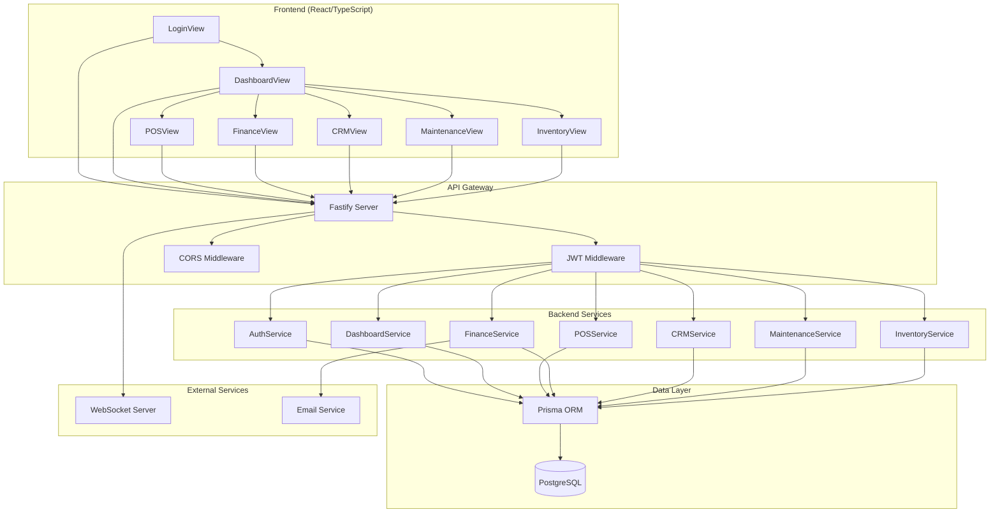
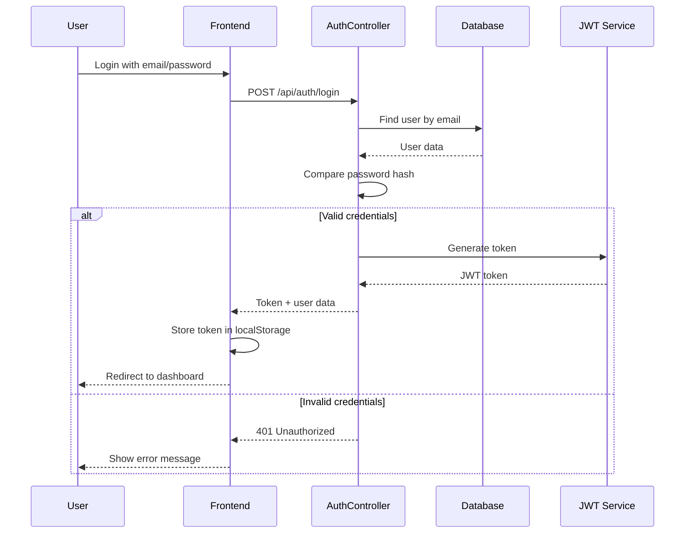
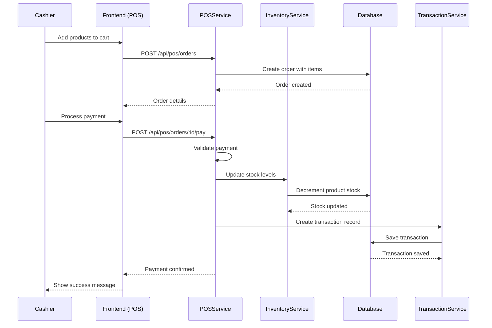
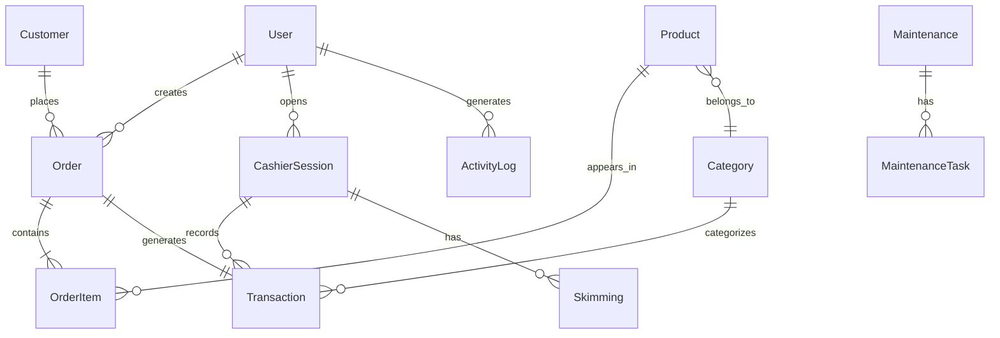
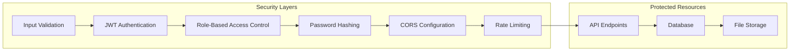

# Arquitetura do Sistema Arena D65

## Visão Geral



## Fluxo de Autenticação



## Fluxo de Venda no POS



## Modelo de Dados



## Arquitetura de Segurança



## Estrutura de Pastas

```
arena-d65/
├── backend/
│   ├── src/
│   │   ├── controllers/     # Request handlers
│   │   ├── services/        # Business logic
│   │   ├── middlewares/     # Auth, validation, etc.
│   │   ├── utils/           # Helper functions
│   │   ├── routes/          # Route definitions
│   │   ├── types/           # TypeScript types
│   │   └── lib/             # External libraries (Prisma)
│   ├── prisma/
│   │   ├── schema.prisma    # Database schema
│   │   └── migrations/      # Database migrations
│   └── scripts/             # Seed scripts
├── frontend/
│   ├── components/          # Reusable UI components
│   ├── views/               # Page components
│   ├── services/            # API calls
│   ├── hooks/               # Custom React hooks
│   └── types/               # TypeScript types
├── docs/                    # Documentation
└── plans/                   # Implementation plans
```

## Tecnologias Utilizadas

### Frontend
- **React 18** - UI library
- **TypeScript** - Type safety
- **Vite** - Build tool
- **React Query** - Server state management
- **Axios** - HTTP client
- **Recharts** - Data visualization
- **Lucide React** - Icons

### Backend
- **Node.js** - Runtime
- **Fastify** - Web framework
- **TypeScript** - Type safety
- **Prisma** - ORM
- **PostgreSQL** - Database
- **JWT** - Authentication
- **bcryptjs** - Password hashing
- **WebSocket** - Real-time communication

### DevOps
- **Docker** - Containerization
- **GitHub** - Version control
- **VPS** - Hosting